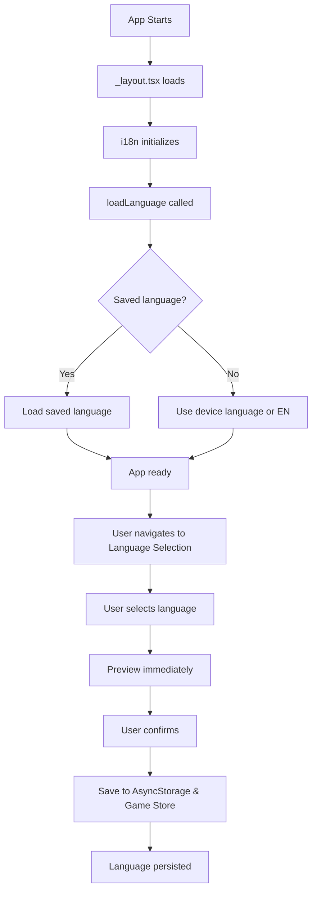

# i18n Multi-Language Implementation Summary

## ✅ Implementation Complete!

Your Chocolate app now has full multi-language support using **i18next** and **react-i18next**.

---

## 📁 Files Created

### Translation Files
- ✅ `i18n/locales/en.json` - English translations
- ✅ `i18n/locales/ru.json` - Russian translations
- ✅ `i18n/locales/id.json` - Indonesian translations

### Configuration Files
- ✅ `i18n/index.ts` - i18next initialization and configuration
- ✅ `i18n/i18n.d.ts` - TypeScript type definitions for i18next

### Hooks
- ✅ `hooks/useI18n.ts` - Custom hook for easy i18n usage with language mapping

### Documentation
- ✅ `i18n/README.md` - Complete i18n documentation
- ✅ `docs/I18N_QUICK_START.md` - Quick start guide
- ✅ `docs/I18N_USAGE_EXAMPLES.md` - Practical usage examples
- ✅ `INSTALLATION_COMMANDS.md` - Installation and setup commands
- ✅ `I18N_IMPLEMENTATION_SUMMARY.md` - This file

---

## 🔧 Files Modified

### 1. `state/useSettingsStore.ts`
**Changes:**
- Added `isLanguageLoaded` state
- Updated `setLanguage()` to be async and integrate with i18next
- Added `loadLanguage()` function to restore saved language on app start
- Imported i18n configuration

### 2. `app/_layout.tsx`
**Changes:**
- Imported i18n configuration (`'../i18n'`)
- Imported `useSettingsStore`
- Added `useEffect` hook to call `loadLanguage()` on app start

### 3. `app/languageSelection.tsx`
**Changes:**
- Imported `useTranslation` from react-i18next
- Imported `useSettingsStore` for language management
- Updated language codes from `'english'` to `'en'`, etc.
- Added language mapping utilities
- Replaced hardcoded strings with `t()` function calls
- Immediate language preview when selecting

---

## 🌍 Supported Languages

| Language | Code | Status |
|----------|------|--------|
| 🇺🇸 English | `en` | ✅ Default |
| 🇷🇺 Russian | `ru` | ✅ Supported |
| 🇮🇩 Indonesian | `id` | ✅ Supported |

---

## 🎯 Features Implemented

### ✅ Core Features
- [x] Multi-language support (EN, RU, ID)
- [x] Language persistence with AsyncStorage
- [x] Automatic language detection on first launch
- [x] Real-time language switching
- [x] TypeScript support
- [x] Custom hooks for easy usage

### ✅ Developer Experience
- [x] Comprehensive documentation
- [x] Usage examples
- [x] Quick start guide
- [x] TypeScript type safety
- [x] Clean API with custom hooks

### ✅ User Experience
- [x] Seamless language switching
- [x] Language preference persists across sessions
- [x] Immediate preview when selecting language
- [x] Native device language detection

---

## 📦 Installation Required

Run this command to install the required packages:

```bash
npm install i18next react-i18next react-native-localize
```

See `INSTALLATION_COMMANDS.md` for detailed instructions.

---

## 🚀 How to Use

### Basic Usage

```tsx
import { useTranslation } from 'react-i18next';

function MyComponent() {
  const { t } = useTranslation();
  return <Text>{t('common.back')}</Text>;
}
```

### Using Custom Hook

```tsx
import { useI18n } from '@/hooks/useI18n';

function MyComponent() {
  const { t, currentLanguage, changeLanguage } = useI18n();
  
  return (
    <View>
      <Text>{t('common.continue')}</Text>
      <Button 
        title="Switch to Russian" 
        onPress={() => changeLanguage('ru')} 
      />
    </View>
  );
}
```

---

## 📋 Translation Keys Available

### Common
- `common.back` - "BACK"
- `common.continue` - "Continue"
- `common.confirm` - "Confirm & Continue"
- `common.start` - "Start"
- `common.next` - "Next"
- `common.skip` - "Skip"
- `common.done` - "Done"
- `common.cancel` - "Cancel"
- `common.yes` - "Yes"
- `common.no` - "No"
- `common.menu` - "Menu"

### Language Selection
- `languageSelection.title` - "Language"
- `languageSelection.english` - "English"
- `languageSelection.russian` - "Russian"
- `languageSelection.indonesian` - "Bahasa Indonesia"

### Auth
- `auth.signIn` - "Sign In"
- `auth.signUp` - "Sign Up"
- `auth.email` - "Email"
- `auth.password` - "Password"

### Game
- `game.round` - "Round"
- `game.level` - "Level"
- `game.truth` - "Truth"
- `game.dare` - "Dare"
- `game.success` - "Success"
- `game.failed` - "Failed"
- `game.yourTurn` - "Your Turn"

See the JSON files in `i18n/locales/` for all available keys.

---

## 🔄 Language Flow



---

## 🎓 Next Steps

### For Developers

1. **Install packages**: Run `npm install i18next react-i18next react-native-localize`
2. **Test it**: Navigate to language selection and try switching languages
3. **Add translations**: Start replacing hardcoded strings with `t('key')` calls
4. **Read docs**: Check `docs/I18N_QUICK_START.md` for examples

### Adding Translations to Existing Screens

To translate an existing screen:

1. Add translation keys to all 3 JSON files
2. Import `useTranslation` in your component
3. Replace strings with `t()` calls

Example:
```tsx
// Before
<Text>Welcome</Text>

// After  
import { useTranslation } from 'react-i18next';

const { t } = useTranslation();
<Text>{t('welcome.title')}</Text>
```

---

## 🧪 Testing Checklist

- [ ] Install required packages
- [ ] Run app and navigate to language selection
- [ ] Switch between languages and verify UI updates
- [ ] Close app and reopen - verify language persists
- [ ] Test all 3 languages (EN, RU, ID)
- [ ] Test on both iOS and Android (if applicable)

---

## 📚 Documentation Reference

| Document | Purpose |
|----------|---------|
| `i18n/README.md` | Complete reference guide |
| `docs/I18N_QUICK_START.md` | Get started in 5 minutes |
| `docs/I18N_USAGE_EXAMPLES.md` | Real-world examples |
| `INSTALLATION_COMMANDS.md` | Setup instructions |

---

## 🎨 Customization

### Adding a New Language

1. Create new translation file: `i18n/locales/fr.json`
2. Add to `i18n/index.ts` resources
3. Update `languageMap` in `hooks/useI18n.ts`
4. Add to language selection screen

### Modifying Translations

Edit the JSON files in `i18n/locales/`:
- `en.json` for English
- `ru.json` for Russian
- `id.json` for Indonesian

Changes will be reflected immediately in development.

---

## ⚙️ Technical Details

### State Management
- **i18next**: Core translation engine
- **useSettingsStore**: Persists language preference
- **useGameStore**: Stores game-specific language state

### Storage
- **AsyncStorage**: Persists user's language choice
- **Zustand**: In-memory state management

### Language Detection
- Uses `react-native-localize` to detect device language
- Falls back to English if device language not supported

---

## 🐛 Known Issues & Solutions

### Issue: Language not changing
**Solution**: Make sure you're using `await setLanguage(lang)`

### Issue: Translations not loading
**Solution**: Verify i18n is imported in `_layout.tsx`

### Issue: TypeScript errors
**Solution**: Check `i18n.d.ts` is in your project

---

## 📞 Support

If you encounter issues:
1. Check the documentation in `i18n/README.md`
2. Review examples in `docs/I18N_USAGE_EXAMPLES.md`
3. Verify installation in `INSTALLATION_COMMANDS.md`

---

## 🎉 Summary

You now have a fully functional multi-language system with:
- ✅ 3 languages supported (EN, RU, ID)
- ✅ Persistent language storage
- ✅ Easy-to-use API
- ✅ TypeScript support
- ✅ Comprehensive documentation
- ✅ Real-world examples

**Ready to use!** Start translating your app by replacing hardcoded strings with translation keys.

---

**Implementation Date**: 2025-10-08  
**Framework**: React Native + Expo  
**Libraries**: i18next, react-i18next, react-native-localize  
**Languages**: English, Russian, Bahasa Indonesia

Happy coding! 🚀

