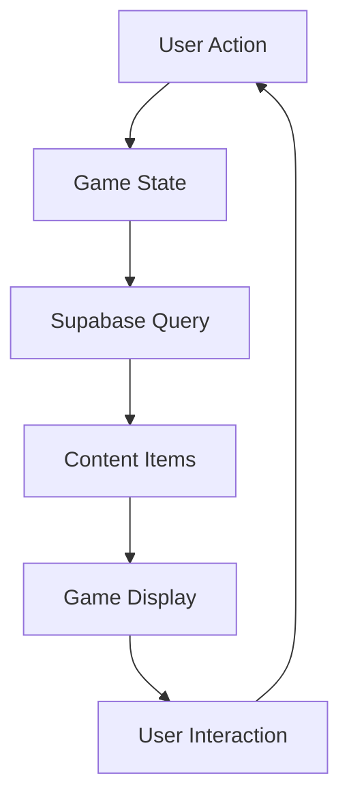

# Hushh Game - API Implementation Documentation

## 1. Database Structure & APIs

### 1.1 User Management
**Table: `user_profiles`**
```sql
create table public.user_profiles (
  id uuid not null,
  her_name text null,
  his_name text null,
  games_played integer null default 0,
  games_completed integer null default 0,
  created_at timestamp with time zone null default now(),
  updated_at timestamp with time zone null default now()
)
```

**APIs Implemented:**
1. **User Profile Creation**
   ```typescript
   // Creates new user profile after registration
   const { data, error } = await supabase
     .from('user_profiles')
     .insert([{ id: user.id, her_name, his_name }])
   ```

2. **Game Statistics Tracking**
   ```typescript
   // Updates game completion statistics
   const { data, error } = await supabase
     .from('user_profiles')
     .update({
       games_played: games_played + 1,
       games_completed: games_completed + 1
     })
     .eq('id', userId)
   ```

### 1.2 Game Content Management
**Table: `content_items`**
```typescript
Interface:
{
  id: string
  content: string
  subContent_1: string
  subContent_2: string
  subContent_3: string
  subContent_4: string
  subContent_5: string
  content_1_time: number
  content_2_time: number
  content_3_time: number
  content_4_time: number
  content_5_time: number
  category: string
  metadata: {
    round: string
    gameType: string
    tags: string[]
  }
}
```

**APIs Implemented:**

1. **Game A Prompts**
   ```typescript
   // Fetches prompts for Game A with specific filters
   const { data: prompt } = await supabase
     .from('content_items')
     .select(`
       id,
       content,
       subContent_1,
       subContent_2,
       subContent_3,
       subContent_4,
       subContent_5,
       content_1_time,
       content_2_time,
       content_3_time,
       content_4_time,
       content_5_time,
       challenges!inner (id, name)
     `)
     .ilike('category', '%game_a_prompt%')
     .eq('metadata->>round', 'Round One')
     .eq('challenges.name', playerType)
   ```

2. **Game B Prompts**
   ```typescript
   // Similar structure but with Game B specific content
   .ilike('category', '%game_b_prompt%')
   ```

3. **Task Completion Prompts**
   ```typescript
   // Fetches success messages and rewards
   .ilike('category', `%${categoryTypes.taskComplete}%`)
   ```

4. **Failure Prompts**
   ```typescript
   // Handles game failure scenarios
   .ilike('category', `%${categoryTypes.fail}%`)
   ```

5. **Post-Failure Prompts**
   ```typescript
   // Recovery and continuation messages
   .ilike('category', `%${categoryTypes.postFail}%`)
   ```

### 1.3 Challenge Management
**Table: `challenges`**
```typescript
Interface:
{
  id: string
  name: string  // Format: "Her1", "Him1", etc.
  level: number
  type: string
}
```

**APIs Implemented:**
```typescript
// Fetches challenge details with inner join
.select('*, challenges!inner(*)')
.eq('challenges.name', `${genderTypes[currentTurn]}${level}`)
```

## 2. Authentication APIs

### 2.1 Email Authentication
```typescript
const emailVerificationService = {
  // Sends OTP code
  sendVerificationCode: async (email) => {
    const { data } = await supabase.auth.signInWithOtp({
      email,
      options: { shouldCreateUser: true }
    })
  },

  // Verifies OTP code
  verifyCode: async (email, code) => {
    const { data } = await supabase.auth.verifyOtp({
      email,
      token: code,
      type: 'email'
    })
  }
}
```

### 2.2 Google Authentication
```typescript
const googleAuth = {
  // Sign in with Google
  signInWithGoogle: async (response) => {
    const { data } = await supabase.auth.signInWithIdToken({
      provider: "google",
      token: idToken
    })
  },

  // Sign out functionality
  signOut: async () => {
    const { error } = await supabase.auth.signOut()
  }
}
```

## 3. Real-time Features

### 3.1 Game State Updates
- Implements real-time game state synchronization
- Handles concurrent player actions
- Manages game progression and state transitions

## 4. Data Flow Architecture



## 5. Implementation Highlights

1. **Message Queue System**
   - Handles sequential message delivery
   - Manages timing and animations
   - Supports multiple message types

2. **Dynamic Content Loading**
   - Random prompt selection
   - Context-aware content filtering
   - Multi-language support

3. **State Management**
   - Centralized game state
   - Persistent user preferences
   - Session management

4. **Error Handling**
   - Graceful error recovery
   - User-friendly error messages
   - Network state management

## 6. Security Features

1. **Authentication**
   - Multi-provider support
   - Secure token management
   - Session persistence

2. **Data Protection**
   - Row Level Security (RLS)
   - Input validation
   - SQL injection prevention

## 7. Performance Optimizations

1. **Query Optimization**
   - Efficient joins
   - Indexed searches
   - Cached responses

2. **State Updates**
   - Batched updates
   - Optimistic UI updates
   - Debounced operations
